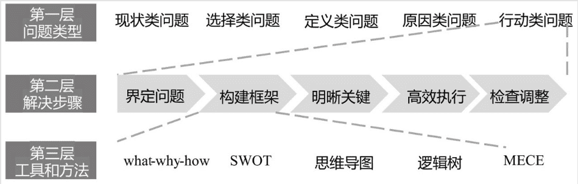
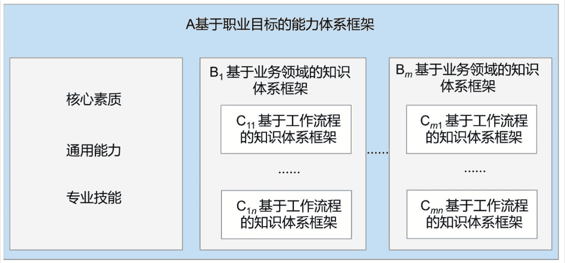
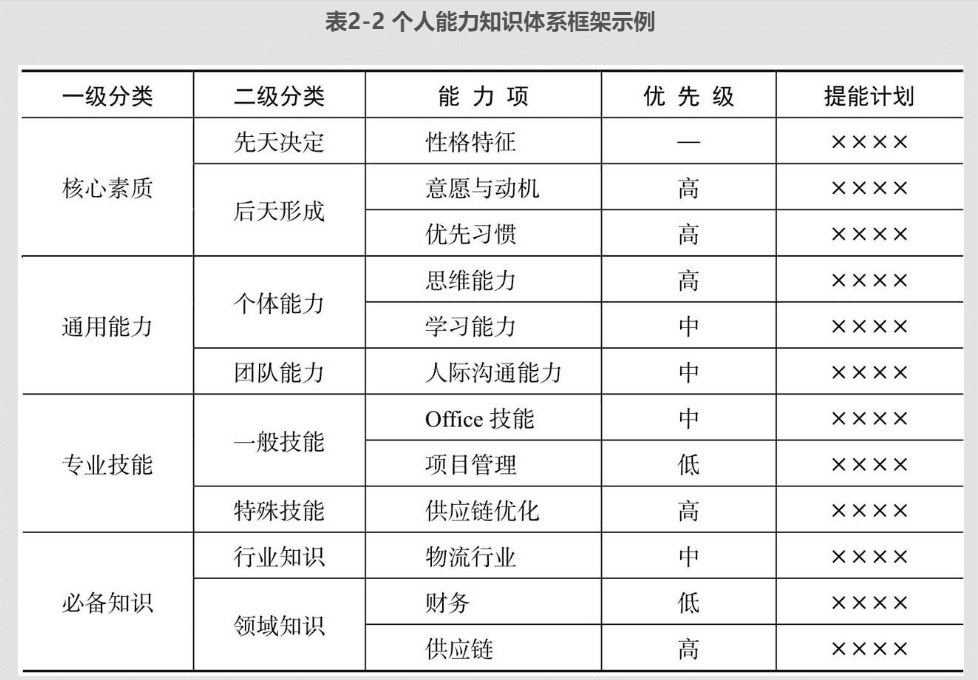
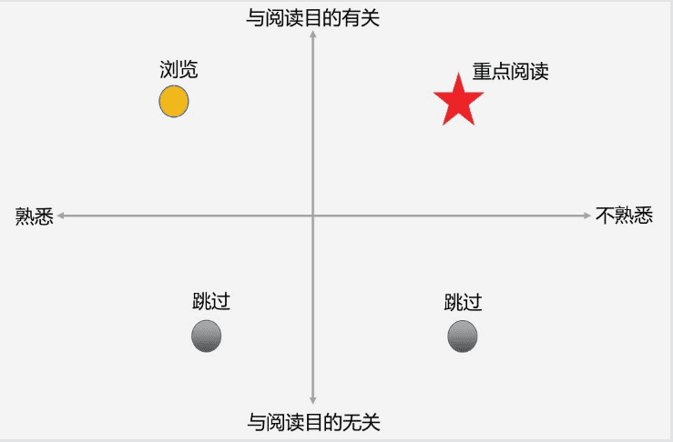

# 学习力：颠覆职场学习的高效方法

## 三大学习策略

### 功利性学习

- 大脑的缺陷
  - 是懒惰重复者和勤劳管理者的结合体
    - 特性
      - 喜欢重复不变
      - 喜欢长期维持当前状态（习惯）
      - 抗拒大幅度的变化
    - 改变
      - 巧用方法（🈲 莽撞的刻苦坚持）学习新技能
  - 很容易被满足
    - 特性
      - 大脑的奖励机制分不清现实成果和未来承诺的成果
        - 会对能完成目标的可能性感到兴奋，错把可能性当作真正完成了目标
        - 自以为会了，停留在表层，未深入
  - 是忘性超大的不靠谱存储体
- 功利性学习的定义
  - 从工作实际需要出发，学习后立马应用
    - 解决意志力消耗大，难以坚持的问题
    - 避免浅层学习，深入掌握方法技能
    - 在工作中自然重复，抵抗遗忘曲线
- 功利性学习步骤
  - 选择一个要着手解决的问题
  - 确定学习范围顺序
    - 控制住想学更多东西的冲动，紧紧围绕解决问题的需要确定范围
      - 不耽误和浪费有限时间、精力
  - 实际应用所学内容去解决问题
    - 无经验时，严格遵循所学方法一丝不苟套用
      - 只有严格套用，才能根据反馈证明方法是否有用
      - 只有严格套用，才能真正理解所学方法，并根据实际情况改进

### 搭好框架

- 给问题进行分类，归纳问题的解决步骤
  - 
- 高质量的个人知识体系框架的标准
  - 整体性
    - 以本质的内在联系将知识组织为一个整体，并服务于同一个根本应用目标
  - 调整型
    - 在实现目标的过程中，发现阻碍干扰，能快速修正
  - 转换性
    - 目标发生变化，能够同步转换以支撑新目标的实现
- 个人知识体系框架的类型
  - 
  - 
  - 基于工作流程
    - 例如销售流程、开发项目管理方法论、软件实施项目管理方法论、解决问题五步法
  - 基于业务领域
    - 利用专业知识背后相同的本质规律（定理、原理）来组织知识
  - 基于职业目标
    - 将所有的核心素质（性格、优先习惯）、通用能力（思维、人际沟通）、专业技能、必备知识围绕某个职位目标，整合为一个有机联系的整体
    - 关键
      - 从实际职位目标触发，根据职位要求构建知识体系
      - 随着职位目标的改变或职位晋升，逐步修正能力知识体系

### 可迁移

- 知识和技能可迁移能力分类
  - 近迁移
    - 运用已有知识技能处理和之前情境类似的任务或目标
    - 关键
      - 整理出通用、具体、成体系的流程框架和工具方法，在处理类似任务的时候就能快速套用
  - 远迁移
    - 运用已有知识技能处理和之前经验（比如跨岗位、跨行业）发生情境大相径庭的任务问题
    - 关键
      - 抽象出一般规律上的联系
- 提升知识和技能可迁移性的方法
  - 组织好先前知识和经验，不从零开始
  - 在多样化（而非单一）的情境中应用
    - 能够知道更多可使用该知识的情境
    - 体会在不同情境中知识运用结果的差异，从而条件化知识
    - 途径
      - 解决多个不同的具体案例
      - 采用【如果-怎么办】策略
  - 对知识做更高层次的抽象
    - 途径
      - 将多个具体的案例概括、抽象为问题类型
      - 从更本质的原理、规律出发去思考问题

## 五类学习技巧

### 搜索技巧

- 掌握搜索引擎的工作原理去搜索
  - 与规则，多个关键词，用空格隔开
  - 包含任意关键词，用竖线隔开
  - 包含完整关键词，用双引号包裹
  - 作品使用书名号《》
  - 排除关键词，在关键词前使用短横线
  - 限定搜索网站，用 site:www.baidu.com的形式，某类网站用site:gov的域名后缀形式
  - 查询指定文件类型，用 filetype:ppt
  - 关键词位于网页标题，title:xxx
  - 百度快照
  - 百度高级搜索
- 换位思考，从搜索引擎的角度检索
- 逐步逼近
  - 从模糊到具体，从宽泛到具体

### 阅读技巧

- 四大阅读理念
  - 带着目的阅读
    - 围绕目的选书
    - 做阅读前准备
    - 阅读过程中锁定和目的有关内容
  - 看第二遍
    - 第一遍要克服怕看漏的心理，阅读速度要快，对于看不懂、不感兴趣的地方跳过
  - 阅读后回忆
    - 每隔一段时间停下来，用自己的语言回忆刚刚阅读的内容，有助于强化大脑记忆，同时发现记不牢理解不清的地方
  - 按自己的框架重新组织阅读内容
- 阅读方法分类
  - 整体阅读
    - 适用场景
      - 准备做某件事或某个改变
      - 寻找某个具体问题的解决方案
      - 思路受到阻碍，想从书中得到另外视角的启发
      - 了解某个基本原理
      - 了解一本书的主要内容
    - 步骤
      - 确定阅读目的
        - 想解决什么问题
        - 想解决到什么程度
      - 提出具体问题
        - 看书的封面、腰封、简介、前言、目录确定和阅读目的是否相符
        - 根据作者简介及对本书内容的了解，将阅读目的转化为跟作者提问的具体问题
      - 选出 16 个关键词或关键句
        - 翻阅速度以看清每页内容为标准
        - 提炼的关键词句要与问题相关
      - 挑选三个关键点
        - 从关键词句中挑选
        - 对关键词句做分类汇总，归纳
      - 归纳问题的结论
  - 多重阅读
    - 适用场景
      - 系统学习
    - 步骤
      - 明确目的
      - 画出框架
        - 根据非章节的书籍信息中绘制
      - 变速阅读
        - 第一遍泛读，变速阅读
          - 不相干内容跳过
          - 目的相关且熟悉的内容快速浏览
          - 目的相关陌生的内容正常速度浏览，辅以阅读后回忆
          - 目的相关且第一遍理解难的内容，重点标记有印象即可，在第二遍重点阅读时，会发现更容易理解
          - 在阅读时，给内容做不要读，以后读，重点读等的标记
          - 
        - 第一遍阅读目的是理清主要脉络，形成初步理解，抓住重点内容
      - 重点精读
        - 克制住反复阅读已熟悉内容的冲动，避免浪费时间
        - 第二遍阅读的目的是将阅读内容归到知识体系中，变成自己的理解和知识，所以需要做笔记
        - 第三遍之后的阅读中，只阅读未彻底理解的，或是在应用上碰到疑问的
  - 主题阅读
    - 适用场景
      - 真的行业、专业领域、具体问题，在某段时间内集中阅读材料，快速建立全新知识体系或完整解决方案的阅读方法
      - 在大规模阅读之前，构建整体主题框架，按图索骥收集资料重点阅读
    - 步骤
      - 搭建主题框架
        - 对主题内容陌生时，应该翻一遍书，构建基本框架，开始主题阅读；选用多本结构完整、逻辑清晰、内容浅显的书
        - 对主题内容有一定了解时，基于已有的理解，从阅读目的出发构建主题框架进行阅读修正
      - 填充主题框架
        - 对于思路的输入，应该更新到主题框架中
        - 对于应用的材料，复制到文档笔记中，便于后续索引

### 理解技巧

- 四大知识类别
  - 事实性知识
    - 概念
      - 指分离的、孤立的、信息片段形成的知识
    - 学习策略
      - 背得快、记得牢（记忆方法好）
        - 记忆方法
          - 思维导图
            - 中心向四周发散
          - 记忆宫殿
            - 提前设定熟悉的环境空间，在其中布置元素及其顺序。以后记忆其他知识时，可分别映射到空间元素上
      - 不要将精力脑力，用在价值很低的事实性知识上
  - 概念性知识
    - 概念
      - 指一般的名词概念、模型、原则、原理、理论
      - 包含一些相互联系的、非任意性的、结构能良好组织的事实性知识
    - 掌握程度判断
      - 能清楚知道这个知识的来龙去脉
      - 能建立这个知识和其他知识的联系
        - 使用三大学习策略进行关联
      - 能知道这个知识的使用场景和不能使用的场景
      - 能够对这个知识进行类比和比喻
  - 程序性知识
    - 概念
      - 指的是如何做某件事的知识
      - 以需要遵循的一系列步骤的形式出现
    - 学习误区
      - 低效率上手
        - 被动、片段式的学习
      - 无意识重复
        - 不知道为啥这么做，不去想优化的空间
    - 学习步骤
      - 流程化
        - 书面整理出程序性知识的流程
      - 刻意用
        - 有意识的应用流程步骤
        - 每开始一个新任务时，就将这个流程模板复制一份，然后按照流程执行，这样还能够完善流程
      - 一般化
        - 提炼出更具一般性的流程
  - 元认知知识
    - 概念
      - 一个人底层的能力表现（思维能力、学习能力、沟通能力）
      - 一个人反思自己表现的能力（制定计划、自我监控、自我调整）
    - 元认知是体现在一切的知识学习、问题解决之中的，是一个人能不能认清自我，能不能提炼一般方法、能不能自我反思和自我调节的决定性因素
    - 在学习、理解和应用事实性知识、概念性知识、程序性知识的过程，就是元认知过程

### 积累技巧

- 知识信息沉淀的状态
  - 知识仓库
    - 仅仅是储存
  - 知识体系
    - 将知识仓库转成自己的东西
- 分类
  - 收藏技巧
    - 更便捷的打造个人知识仓库，让有用的资料燕过留毛（比如微信收藏）
    - 收藏的基本要素
      - 便捷的收藏
      - 良好的、高效的索引
  - 笔记技巧
    - 更高效的将别人的知识记录、加工、吸收为自己的知识（仓库->体系转变的关键）
    - 记笔记的目的
      - 记忆
      - 练熟
      - 理解
      - 沉淀
    - 记笔记的错误操作
      - 一字不差抄写
      - 文字不精炼
      - 页面满满当当无空白
    - 记笔记的方式
      - 纸质笔记场景
        - 不方便情况下的速记
        - 需要深度理解的场合
      - 电子笔记场景
        - 速记式笔记
          - 文字、图片、语言、视频
        - 流程式笔记
        - 梳理式笔记
          - 阅读的思维导图
        - 学习式笔记（输入）
          - 听课
            - 教师讲授的内容、自己理解的内容、自己的心得
          - 阅读
        - 总结式笔记（输出）
  - 组织技巧
    - 如何组织知识（将知识进行分类存储）转化为知识体系

### 应用技巧

- 职场学习的特征
  - 为用而学，要求一学就能用
  - 要能越用越好，越用越深
- 分类
  - 最简应用
    - 方式
      - 使用搜索引擎、书籍查找直接的解决方案
    - 好处
      - 花费更少的时间，快速满足工作需求
      - 降低应用难度，提升学习的自我效能感
  - 自然重复
    - 方式
      - 提炼成模板或清单
      - 整体应用
        - 结构化为一个更为体系化的框架

## 技能的学习和应用

### 概念

- 知识
  - 客观存在的东西，若未使用，则毫无价值
- 技能
  - 某种工具的使用方法，某个具体工作的完成技巧
- 能力
  - 学习能力、表达能力

### 技能的分类

- 程序性认知技能
  - 概念
    - 要求先理解，理解后强调操作或记忆的熟练度（刻意练习）
  - 特征
    - 先理解
    - 强调熟练度
  - 误区
    - 理解万全后再上手
      - 缺少实操，导致一知半解
      - 大量学习的内容一时用不上，浪费大量精力时间
    - 完全不经理论指导直接上手
      - 凭先前经验尝试，导致时间精力浪费在不必要的试错上
      - 效率低
  - 学习步骤
    - 基本了解
      - 从功利性应用出发，明确学习目的
      - 运用检索技巧检索基本的学习资料
        - 不要贪大求全，找到能完成任务的资料即可
        - 大致阅读资料，了解主要内容即可
      - 运用笔记技巧搭建技能的最粗颗粒度框架
        - 更容易理解组成技能的各部分知识
        - 不容易陷入细节中
    - 简单入门
      - 学习的最大敌人之一就是复杂性
      - 不能贪大求全，企图全部搞懂在上手
        - 效率低
        - 打击自信心
      - 从最简单最常用的内容入手，在工作中逐步深化
    - 迭代深化
    - 自然重复
- 理解性认知技能
  - 概念
    - 强调理解的深度，要求能够抽象出更一般的规律
  - 特征
    - 概念性知识占主体
    - 强调对规律认知的广度和深度（熟练度），不同知识侧重点不同
  - 误区
    - 靠直觉而非相对成熟的框架入门
    - 死搬理论，不知变通和改进
  - 学习步骤
    - 挑选框架
      - 方式
        - 请教有经验的人
        - 上网搜索
        - 看书
    - 生搬硬套
      - 为什么要这么做
        - 理解性技能包含大量概念性知识，而此时对概念的理解有限，难以做出最好的应用
        - 只有严格套用，才能对框架有全面了解
        - 假如结果不合预期，能根据应用结果分析该框架哪些部分需要调整和改进
    - 质疑改进
      - 应用层面
        - 根据应用效果差异质疑框架的实用性
      - 理论层面
        - 探索框架背后理论的来龙去脉，了解分析理论的不足
- 行为技能
  - 概念
    - 强调身体熟练度的技能，核心是熟能生巧（刻意练习）
  - 特征
    - 程序性知识占主体
    - 强调动作的熟练度与准确度
  - 误区
    - 靠直觉而非模仿专业示范入门
    - 盲目模仿，没有量力而行
    - 一味重复，没有细化改进
  - 学习步骤
    - 挑选对象
      - 请教有经验的人
      - 上网搜索
      - 看书
    - 量力而行
    - 分解简化
    - 局部细化

### 综合应用：如何快速切入一个新领域行业

- 避开的陷阱
  - 生搬硬套先前知识或经验
  - 把自己当一张白纸，完全从零开始
    - 建构主义者认为，所谓的学习，就是个体对知识的不断建构。建构就是带着先前知识和经验来理解新环境和新事物，并且根据新的认知，不断地修正先前知识和经验，总结出更完善的知识体系，以便今后更好地学习、理解和应用。
  - 贪大求全，想毕其功于一役
    - 围绕工作需要，先学急用和基础的内容
- 学习步骤
  - 构建框架
    - 方式
      - 请教有经验的人
      - 参加培训
      - 看书
        - 选择内容浅覆盖广的
        - 多看几本
  - 比对迁移
    - 对照整体框架做迁移时，比对的是知识和技能，非能力素质
  - 功利性学习
    - 新行业领域必备的基础技能先掌握
    - 与工作需要的迫切程度一致
    - 根据工作类型确定学习深度
  - 整体应用
    - 实践
  - 改进迭代
    - 情形
      - 个人理解和应用出了问题
      - 应用前提不一致
      - 理论不完善
