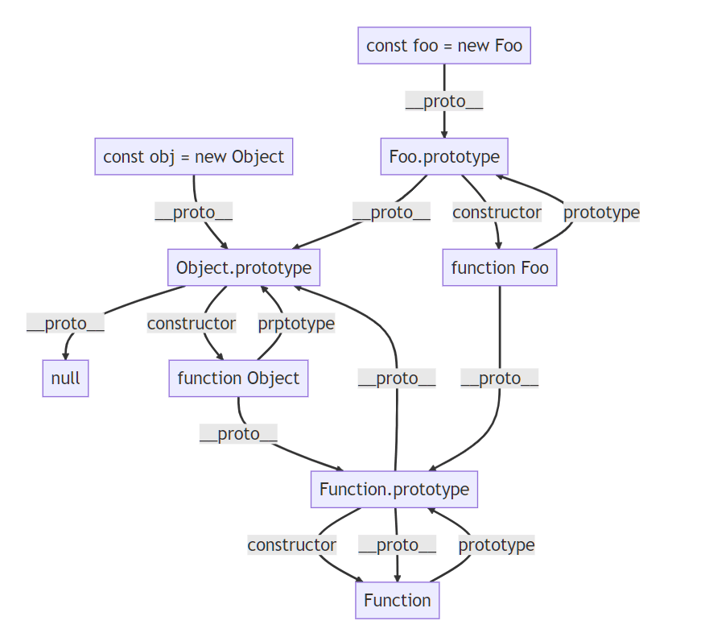

# JavaScript

## 空值合并运算符`??`和逻辑或运算符`||`

- `??`：空值合并运算符，当左侧值为null或undefined时，返回右侧值
- `||`：逻辑或运算符，当左侧值为假值(`null`, `undefined`, `false`, `0`, `-0`, `0n`, `NaN`, `''`, `document.all`)时，返回右侧值

## 中止Web请求`AbortController`、`AbortSignal`

**`AbortController`**：控制器对象，允许根据需要中止一个或多个Web请求

实例属性和方法：

- `abortController.signal`：返回一个AbortSignal实例，可以用它和异步操作通信或者中止这个操作
- `abortController.abort()`：中止一个尚未完成的异步操作

**`AbortSignal`**：信号对象，允许通过AbortController对象与DOM请求进行通信，并在需要时中止它

属性和方法：

- `AbortSignal.aborted`：是否已中止
- `AbortSignal.abort()`: 返回一个已经被设置为中止的AbortSignal实例
- `AbortSignal.timeout(ms)`：返回一个在指定时间后自动终止的AbortSignal实例

::: code-group

```javascript [使用显式信号中止fetch操作]
let controller
const url = 'video.mp4'

const downloadBtn = document.querySelector('#download')
const abortBtn = document.querySelector('#abort')

downloadBtn.addEventListener('click', fetchVideo)

abortBtn.addEventListener('click', () => {
  if (controller) {
    controller.abort()
    console.log('已中止')
  }
})

function fetchVideo() {
  controller = new AbortController()
  const signal = controller.signal

  fetch(url, { signal }).then(res => {
    console.log(res, '下载完成')
  }).catch(err => {
    console.log(err, '下载失败')
  })
}
```

```javascript [中止超时的读取操作]
const url = 'video.mp4'

try {
  // 1000ms后自动中止
  const res = await fetch(url, { signal: AbortSignal.timeout(1000) })
  const result = await res.blob()
  // ...
} catch (err) {
  if (err.name === 'AbortError') {
    console.log('fetch abort by user action')
  } else if (err.name === 'TimeoutError') {
    console.log('fetch timeout')
  } else if (err.name === 'TypeError') {
    console.log('abortSignal.timeout() is not a function')
  } else {
    console.log('fetch error')
  }
}
```

```javascript [超时或显式中止fetch]
try {
  const controller = new AbortController()
  // 1s后自动中止
  const timeoutId = setTimeout(() => controller.abort(), 1000)
  const res = await fetch(url, { signal: controller.signal })
  const body = await res.json()
} catch (err) {
  if (err.name === 'AbortError') {
    // 用户中止
  } else {
    console.log('fetch error')
  }
} finally {
  clearTimeout(timeoutId)
}
```

:::

## 对象的数据属性和访问器属性

数据属性：

- writable：值是否可写
- value
- enumerable：值是否可枚举
- configurable：数据属性是否可修改

访问器属性：

- get:
- set:
- enumerable:
- configurable:

相关方法：

- `Object.defineProperty(obj, key, { // descriptor obj })`
- `Object.defineProperties(obj, { key: { // descriptor obj}, ...})`
- `Object.getOwnPropertyDescriptor(obj, key)`

## toString()和valueOf()

toString:

- 将对象转成一个原始值

valueOf:

注意：

- 数字的强制转换和原始值的强制转换，会优先调用valueOf()
- Date对象优先调用toString()，若该方法返回非原始值，则会调用valueOf()
- String()、alert()优先调用对象的toString()，
- 强制类型转换的地方有：在进行`+`、`==`运算时，一方有非数字类型

## 如何实现设置localStorage的有效期？

实现思路：

- 第一种：
  1. 调用setItem存值时，将item存储为一个对象格式，里面包含属性有value、expires（过期时间格式，转为统一的time时间戳格式）
  2. 取值时，将过期时间戳expires与当前的时间戳对比，过期则清空
  3. 清空逻辑有：比如定时器、用户操作时、窗口聚焦时、鼠标滚动时等
- 第二种：查看是否有开源的组件，进行调用

## 数组的常用方法

修改数组：

- fill(value, start, end)
- pop()
- shift()
- push(value, ...)
- unshift(value, ...)
- splice(start, count, value, ...)

返回新数组：

- `concat(value, arr, ...)`
- filter(value, index, arr)
- find
- flat(depth)：数组扁平化
- flatMap(value, index, arr)：返回若直接返回value，功能和flat(1)类似，否则遍历元素，返回每个的结果
- map(value, index, arr)
- reduce((value, index, arr) => {}, initval)
- slice(start, end)

返回迭代器对象：

- keys()
- values()
- entries()

其他：

- find/findLast
- findIndex/findLastIndex
- reverse()
- forEach
- some，一个truth即返回true
- every，所有truth即返回true
- sort(sortFn)
- includes(value, fromIndex)
- join(value)
- Array.from(arr, newArrCallback)：对类数组/可迭代对象转为数组，同时对新数组进行map回调，返回返回新的值
- Array.of(value, ...):将参数表列转为一个数组

## 异步编程

包含：

- Promise
- async-await
- generator
- 回调函数，将同步变异步，类似f1(f2)的方式，可结合settimeout一起，简单但高耦合
- 事件监听
- 发布订阅模式（观察者模式）

## 闭包

> 参考：  
> https://www.ruanyifeng.com/blog/2009/08/learning_javascript_closures.html   
> https://zh.javascript.info/closure  

> 闭包使用场景：  
> https://juejin.cn/post/6844903619595075592  
> https://segmentfault.com/a/1190000023425946 

定义：

- 闭包是能够读取其他函数内部变量的函数
- 由于只有函数内部的子函数才能够读取函数的局部变量，故闭包可以理解为定义在一个函数内部的函数
- 闭包是指一个函数可以记住其外部变量并可以访问这些变量

## 引入css和执行js会阻塞html的渲染吗？

从浏览器输入url到页面渲染的过程中，html通过html解析器生产DOM树，css通过css解析器解析成css对象，然后组成CSSOM树，解析过程互不影响，是并行解析的。**但是**，渲染树需要结合DOM树和CSSOM树才能够生成，这一步会阻塞html的渲染。

具备async和defer属性的script会异步执行脚本，其中：

- async：脚本返回后，若html未解析完，浏览器会暂停解析html，先让js引擎执行代码，这时会阻塞html的渲染
- defer：脚本返回后，若html未解析完，浏览器会继续解析html，在html解析完毕后再执行js代码，不会阻塞html的渲染

## 输入url到页面渲染的过程中，发生了什么？

**1**：

- 输入地址
- 浏览器查找域名的 IP 地址
- 浏览器向 web 服务器发送一个 HTTP 请求
- 服务器的永久重定向响应
- 服务器处理请求
- 服务器返回一个 HTTP 响应
- 浏览器显示 HTML
- 浏览器发送请求获取嵌入在 HTML 中的资源（如图片、音频、视频、CSS、JS等等）

**2**：

- 用户输入url并回车
- 浏览器进程检查url，组装协议，构成完整的url
- 浏览器进程通过进程间通信（IPC）把url请求发送给网络进程
- 网络进程接收到url请求后检查本地缓存是否缓存了该请求资源，如果有则将该资源返回给浏览器进程
- **如果没有，网络进程向web服务器发起http请求（网络请求），请求流程如下**：
  - 进行DNS解析，获取服务器ip地址，端口（端口是通过dns解析获取的吗？这里有个疑问）
  - 利用ip地址和服务器建立tcp连接
  - 构建请求头信息
  - 发送请求头信息
  - 服务器响应后，网络进程接收响应头和响应信息，并解析响应内容
- **网络进程解析响应流程**；
  - 检查状态码，如果是301/302，则需要重定向，从Location自动中读取地址，重新进行第4步 （301/302跳转也会读取本地缓存吗？这里有个疑问），如果是200，则继续处理请求。
  - 200响应处理：检查响应类型Content-Type，如果是字节流类型，则将该请求提交给下载管理器，该导航流程结束，不再进行后续的渲染，如果是html则通知浏览器进程准备渲染进程准备进行渲染。
- **准备渲染进程**
  - 浏览器进程检查当前url是否和之前打开的渲染进程根域名是否相同，如果相同，则复用原来的进程，如果不同，则开启新的渲染进程
- **传输数据、更新状态**
  - 渲染进程准备好后，浏览器向渲染进程发起“提交文档”的消息，渲染进程接收到消息和网络进程建立传输数据的“管道”
  - 渲染进程接收完数据后，向浏览器发送“确认提交”
  - 浏览器进程接收到确认消息后更新浏览器界面状态：安全、地址栏url、前进后退的历史状态、更新web页面

## 类型判断的方式

typeof：

- 能准确判断所有基础数据类型，引用类型会判断为object
- null会判断为object
- Function和函数会判断为function

instanceof：

- 能准确判断引用数据类型，不能判断基础数据类型（得不到正确的结果，因为基础类型类型Number等其实都是对象）

`Object.prototype.toString.call(value)`：

- 能够获取到所有准确的数据类型

## 深拷贝和浅拷贝

## 原型链图

原型：

- 原型（prototype）是函数function对象的一个属性，它定义了构造函数制造出来的对象（new运算符调用的函数）的公共祖先
- 通过构造函数产生的对象可以继承到该原型的属性和对象，原型也是对象。
- 隐式原型(**proto**-->每个实例上都有的属性)和显式原型（prototype-->构造函数的属性）
- 对象的原型（对象原型的最顶端是null）

原型链：

- 在原型上再加一个原型，再加一个原型..把原型连成链，访问顺序也是按照这个链的顺序跟作用域链一样，叫做原型链



## 宏任务、微任务、同步任务

事件循环的本质

- 作为单线程js对异步事件的处理机制
- 仅有一个主线程js的处理逻辑，保证主线程有序、高效、非阻塞的处理

事件循环处理逻辑：

- 同步任务、异步任务（又分为微任务、宏任务，且宏任务优先级高）分别进入不同的执行场所
- 同步任务直接在主线程执行，异步任务则在事件队列event queue中等待
- 当全部同步任务执行完毕后，再去event queue中执行异步回调的函数，异步回调的函数进入到主线程执行
- 异步任务内部的内容，又依次进行上述步骤，这样的机制，叫做事件循环

执行顺序：

- 代码执行顺序：同步任务 -> 微任务 -> 宏任务
- 微任务执行顺序：process.nextTick -> Promise
- 宏任务执行顺序：setImmediate -> setTimeout -> setInterval -> I/O操作 -> ajax

微任务：

- Promise里面的(then、catch、finally)
- async/await
- process.nextTick
- Object.observe(实时监测js对象的变化)
- MutationObserver(监听DOM树的变化)

宏任务：

- 整体代码script
- setTimeout、setInterval、setImmediate
- I/O操作（输入输出，比如文件读取、网络请求）
- ui render（dom渲染）
- ajax

注意：

- vue.nextTick用于在下次dom更新（宏任务）循环结束后执行的延迟回调，在修改数据之后立即使用 nextTick 来获取更新后的 DOM。 nextTick主要使用了宏任务和微任务。 根据执行环境分别尝试采用Promise（微）、MutationObserver（微）、setImmediate（宏），如果以上都不行则采用setTimeout定义了一个异步方法，多次调用nextTick会将方法存入队列中，通过这个异步方法清空当前队列

## 事件委托、事件冒泡、事件捕获

事件委托（事件代理）：

- 即事件（比如点击事件、鼠标移动事件等）本来是加在子元素上，却加在父祖元素上来监听，利用了事件冒泡的原理，因为事件最终都会加在父级上触发执行效果
- 事件委托的好处是减少事件注册，节省内存占用，新增节点时，后续节点自动拥有之前绑定的事件
- 事件委托的缺陷是逻辑变多时，可能会出现事件误判

事件冒泡：

- 事件会从目标节点流向文档根节点，途中会经过目标节点的各个父级节点，

事件捕获：

- 事件从文档根节点流向目标节点，途中会经过目标节点的各个父级节点

注意：

- 事件的处理过程：先捕获，后冒泡
- 事件处理过程中，若某个节点定义了多个同类型事件，某个事件使用了`event.stopImmediatePropagation()`，其他同类型事件不会执行
- 阻止事件的默认操作（比如点击a标签会跳转，点击提交按钮会将数据提交到服务器等）可以用`event.preventDefault();`来阻止
- 阻止事件冒泡和事件捕获：`e.stopPropagation()`
- `addEventListener(event,fn,useCapture)`：第三个参数表示是否触发事件捕获过程
- addEventListener和on的区别：on事件会被后面的on事件覆盖，前者不会

## 防抖和节流

定义：

- **防抖**：在规定的时间内，若上一次的操作未执行（或未执行完毕）（通过一个标志变量来判断是否执行完毕），*则取消上一次内容的执行（比如清除定时器），转而执行当前次的操作*
- **节流**：在规定的时间内，若上一个的操作未执行（或未执行完毕）（通过一个标志变量来判断是否执行完毕），*则不做任何操作（即退出函数，忽略当前次操作），而上一次操作正常执行*

**应用场景**：

- 防抖：输入框输入内容后请求api获取结果
- 节流：输入联想、内容拖动、滚动条滚动、计算鼠标移动的距离，此时需要在一段时间内触发操作，节流比较适合，使用防抖时会一直取消上一次操作，可能在这段时间内不会返回任何内容，影响用户观感

::: code-group

```javascript [防抖]
function debounce (fn, delay = 200) {
  let timer = 0
  return function () {
    if (timer) {
      clearTimeout(timer)
    }
    timer = setTimeout(() => {
      fn.apply(this, arguments)
      timer = 0
    }, delay)
  }
}
```

```javascript [节流]
function throttle (fn, delay = 200) {
  let timer = 0
  return function () {
    if (timer) {
      return false
    }
    timer = setTimeout(() => {
      fn.apply(this, arguments)
      timer = 0
    }, delay)
  }
}
```

:::

## Object.defineProperty和Proxy的区别

**Object.defineProperty(obj, prop, desc)**:

定义：

- 直接在一个对象上定义一个新属性，或者修改对象的已有属性，返回该对象

作用：

- 在vue2中，对于未初始化的对象属性，不能进行直接赋值，可通过$set或Object.assign进行赋值
- 不能监听数组变化：在vue2中，不能直接对数组下标进行赋值，不能直接修改数组长度，可通过$set（赋值）、splice（赋值，修改长度）正常操作
- 必须（深层）遍历（嵌套）对象：只能劫持对象的属性，所以需要对每个属性进行遍历，而属性若是对象，则需深度遍历
- 兼容性好，能够兼容ie

**new Proxy(target, handler)**：

定义：

- 创建一个对象的代理，实现对对象基本操作的拦截和自定义（属性查找、赋值、枚举、函数调用等）

作用：

- 能够针对整个对象，而非对象的某个属性
- 拦截处理函数handler有13种之多
- 返回一个新对象，而不是原有对象

## for...in和for...of

**for...in**：

- 以任意顺序遍历一个对象的除Symbol以外的（包括继承的）可枚举的属性（指的是对象属性描述符enumerable设置为true的）
- 该结构主要用于对象，为了对象而构建的

**for...of**：

- 在可迭代对象（具有iterator接口的）上创建一个迭代循环，遍历他的值

## performance.now和Date.now

**performance.now()**：

- 返回一个以毫秒为单位的数值，表示从time origin之后到当前调用时经过的时间
- 返回值是以一个恒定的速率慢慢增加的，不会受到系统时间的影响（比如手动篡改时间）
- 计算时间间隔：`performance.now() - start`
- `performance.timing.navigationStart + performance.now()`约等于`Date.now()`

**date.now()**：

- 返回一个表示当前时间（从1970年1月1日00:00:00 UTC）到现在的毫秒数
