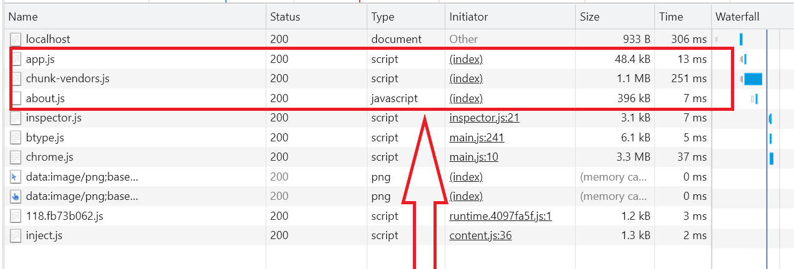
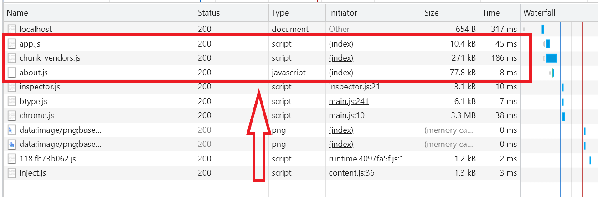

# nginx基础

## 安装

1. 下载nginx：http://nginx.org/
2. 配置环境变量（必须在nginx.exe当前目录下启动ngix，否则会报错[1](https://www.jianshu.com/p/cdf5acfee0c2)，原因是：nginx在使用时conf-path是根据相对路径来找的（由nginx -V可知），另一方式是使用脚本文件

## 基础命令

- 启动nginx：start nginx
- 停止nginx：nginx.exe -s stop(快速停止，不保存相关信息)/quit(有序停止，会保存相关信息)
- 重载nginx：nginx.exe -s reload(更改配置信息时，重新载入配置)
- 重新打开日志文件：nginx.exe -s reopen
- 查看版本：nginx -V

_nginx无法正常停止的方法_：
1. 确认是否正常运行：打开配置的端口网页，正常运行网页能够打开
2. 查看端口是否正在占用：`netstat -ano`，PID通常是排在第一位中
3. 通过PID查找监听该端口的进程：`tasklist|findstr "PID"`
4. 若有某进程，则直接终止：`taskkill /f /t /im nginx.exe`

## 配置gzip压缩

> nginx的配置文件位于：`conf/nginx.conf`

详细配置如下：
::: code-group

```conf [nginx配置示例1]
# 开启gzip压缩服务
gzip on;

# gzip压缩是要申请临时内存空间的，假设前提是压缩后大小是小于等于压缩前的。
# 例如，如果原始文件大小为10K，那么它超过了8K，所以分配的内存是8 * 2 = 16K;再例如，
# 原始文件大小为18K，很明显16K也是不够的，那么按照 8 * 2 * 2 = 32K的大小申请内存。
# 如果没有设置，默认值是申请跟原始数据相同大小的内存空间去存储gzip压缩结果。 

# 设置系统获取几个单位的缓存用于存储gzip的压缩结果数据流。 
# 例如 4 4k 代表以4k为单位，按照原始数据大小以4k为单位的4倍申请内存。 
# 4 8k 代表以8k为单位，按照原始数据大小以8k为单位的4倍申请内存。
# 如果没有设置，默认值是申请跟原始数据相同大小的内存空间去存储gzip压缩结果。
gzip_buffers 2 8k;

# nginx对于静态文件的处理模块。
# 该模块可以读取预先压缩的gz文件，这样可以减少每次请求进行gzip压缩的CPU资源消耗。
# 该模块启用后，nginx首先检查是否存在请求静态文件的gz结尾的文件，如果有则直接返回该gz文件内容。
# 为了要兼容不支持gzip的浏览器，启用gzip_static模块就必须同时保留原始静态文件和gz文件。
# 这样的话，在有大量静态文件的情况下，将会大大增加磁盘空间。我们可以利用nginx的反向代理功能实现只保留gz文件。
gzip_static on|off

# 启用gzip压缩的最小文件，小于设置值的文件将不会压缩
gzip_min_length 1k;

# gzip压缩基于的http协议版本，默认就是HTTP 1.1 
gzip_http_version 1.1;

# gzip 压缩级别，1-10，数字越大压缩的越好，也越占用CPU时间，后面会有详细说明
gzip_comp_level 2;

# 需要进行gzip压缩的Content-Type的Header的类型。建议js、text、css、xml、json都要进行压缩；
# 图片就没必要了，gif、jpge文件已经压缩得很好了，就算再压，效果也不好，而且还耗费cpu。
# javascript有多种形式。其中的值可以在 mime.types 文件中找到。
gzip_types text/plain application/javascript application/x-javascript text/css application/xml text/javascript application/x-httpd-php image/jpeg image/gif image/png;

# 默认值：off
# Nginx作为反向代理的时候启用，开启或者关闭后端服务器返回的结果，匹配的前提是后端服务器必须要返回包含"Via"的 header头。
# off - 关闭所有的代理结果数据的压缩
# expired - 启用压缩，如果header头中包含 "Expires" 头信息
# no-cache - 启用压缩，如果header头中包含 "Cache-Control:no-cache" 头信息
# no-store - 启用压缩，如果header头中包含 "Cache-Control:no-store" 头信息
# private - 启用压缩，如果header头中包含 "Cache-Control:private" 头信息
# no_last_modified - 启用压缩,如果header头中不包含 "Last-Modified" 头信息
# no_etag - 启用压缩 ,如果header头中不包含 "ETag" 头信息
# auth - 启用压缩 , 如果header头中包含 "Authorization" 头信息
# any - 无条件启用压缩
gzip_proxied [off|expired|no-cache|no-store|private|no_last_modified|no_etag|auth|any] ...

# 是否在http header中添加Vary: Accept-Encoding，建议开启
# 和http头有关系，加个vary头，给代理服务器用的，有的浏览器支持压缩，
# 有的不支持，所以避免浪费不支持的也压缩，所以根据客户端的HTTP头来判断，是否需要压缩
gzip_vary on;

# 禁用IE 6 gzip
gzip_disable "MSIE [1-6]\.";
```

```conf [nginx配置示例2]
#user  nobody;
worker_processes  1;

error_log  logs/error.log;
error_log  logs/error.log  notice;
error_log  logs/error.log  info;

#pid    logs/nginx.pid;


events {
  worker_connections  1024;
}

# 设定http服务器，利用它的反向代理功能提供负载均衡支持
http {
  include     mime.types;
  default_type  application/octet-stream;

  #log_format  main  '$remote_addr - $remote_user [$time_local] "$request" '
  #          '$status $body_bytes_sent "$http_referer" '
  #          '"$http_user_agent" "$http_x_forwarded_for"';

  #access_log  logs/access.log  main;
  
  etag 			on;

  sendfile    on;
  #tcp_nopush   on;

  #keepalive_timeout  0;
  keepalive_timeout  65;
	
	# 压缩配置
  gzip  					on;
  gzip_min_length 		256;
  gzip_comp_level 		3;
  gzip_buffers 			32 4k;
  gzip_http_version 		1.1;
  gzip_static 			on;
  gzip_types
    text/plain
    application/javascript
    application/x-javascript
    text/css
    application/xml
    text/javascript
    application/x-httpd-php
    image/jpeg
    image/gif image/png;
  gzip_proxied 			any;
  gzip_vary 				on;
  
  # 缓存配置：http
#  proxy_connect_timeout 10;
#  proxy_read_timeout 180;
#  proxy_send_timeout 5;
#  proxy_buffer_size 16k;
#  proxy_buffers 4 32k;
#  proxy_busy_buffers_size 96k;
#  proxy_temp_file_write_size 96k;
#  proxy_temp_path /tmp/temp_dir;
#  proxy_cache_path /tmp/cache levels=1:2 keys_zone=cache_one:100m inactive=1d max_size=10g;
#	proxy_ignore_headers X-Accel-Expires Expires Cache-Control Set-Cookie;
  
  server {
    listen     				8080;
    server_name  				localhost;
    # 必须为on，否则cache不生效
    proxy_buffering 			on;
    # 方便查看缓存是否生效，也可以把这个加入access log，方便统计
#		add_header X-Cache-Status $upstream_cache_status;
		# cache 使用的 key
#		proxy_cache_key $proxy_host$request_uri;

    #charset koi8-r;

    #access_log  logs/host.access.log  main;

    location / {
      root   html;
      index  index.html index.htm;
#      add_header Cache-Control "Public, max-age=500000" always;
    }
    
		location ~ .*\.(?:jpg|jpeg|gif|png|ico|cur|gz|svg|svgz|mp4|ogg|ogv|webm)$
		{
			add_header Cache-Control "Public, max-age=500000" always;
		}

		location ~ .*\.(?:js|css)$
		{
			add_header Cache-Control "Public, max-age=500000" always;
		}

		location ~ .*\.(?:htm|html)$  #不缓存html
		{
			add_header Cache-Control "no-cache" always;
		}
    
    # 开启缓存
		#要缓存文件的后缀，可以在以下设置。

    #error_page  404        /404.html;

    # redirect server error pages to the static page /50x.html
    #
    error_page   500 502 503 504  /50x.html;
    location = /50x.html {
      root   html;
    }

    # proxy the PHP scripts to Apache listening on 127.0.0.1:80
    #
    #location ~ \.php$ {
    #  proxy_pass   http://127.0.0.1;
    #}

    # pass the PHP scripts to FastCGI server listening on 127.0.0.1:9000
    #
    #location ~ \.php$ {
    #  root       html;
    #  fastcgi_pass   127.0.0.1:9000;
    #  fastcgi_index  index.php;
    #  fastcgi_param  SCRIPT_FILENAME  /scripts$fastcgi_script_name;
    #  include    fastcgi_params;
    #}

    # deny access to .htaccess files, if Apache's document root
    # concurs with nginx's one
    #
    #location ~ /\.ht {
    #  deny  all;
    #}
  }


  # another virtual host using mix of IP-, name-, and port-based configuration
  #
  #server {
  #  listen     8000;
  #  listen     somename:8080;
  #  server_name  somename  alias  another.alias;

  #  location / {
  #    root   html;
  #    index  index.html index.htm;
  #  }
  #}


  # HTTPS server
  #
  #server {
  #  listen     443 ssl;
  #  server_name  localhost;

  #  ssl_certificate    cert.pem;
  #  ssl_certificate_key  cert.key;

  #  ssl_session_cache  shared:SSL:1m;
  #  ssl_session_timeout  5m;

  #  ssl_ciphers  HIGH:!aNULL:!MD5;
  #  ssl_prefer_server_ciphers  on;

  #  location / {
  #    root   html;
  #    index  index.html index.htm;
  #  }
  #}
}
```

:::

配置完成后，必须重启nginx，若重启失败/失效，可先停止nginx进程，然后再次启动nginx

_nginx是否开启gzip压缩的对比_：
- 未开启gzip压缩：
  
- 开启gzip压缩：
  

_注意事项：_
1. 配置未生效：若a.js具有压缩文件a.js.gzip，则运行下面命令，若得出的结果无`Accept-Encoding: gzip`字段，表示配置未生效。此时可重启nginx，或者查看配置的gzip_types是否包含结果中的Content-Type
   ```bash
   $ curl -I -H "Accept-Encoding: gzip, deflate" "http://localhost:8080/a.js"
    HTTP/1.1 200 OK
    Server: nginx/1.15.0
    Date: Wed, 22 Aug 2018 07:56:54 GMT
    Content-Type: application/javascript
    Content-Length: 1414757
    Last-Modified: Wed, 22 Aug 2018 02:43:33 GMT
    Connection: keep-alive
    ETag: "5b7ccdd5-159665"
    Accept-Ranges: bytes
    ```


## 配置缓存

### 基础内容

> nginx变量有哪些？

**_基础命令_**：


**_配置文件信息_**：

```nginx
# 主配置文件: nginx.conf
http {
  # 设置子配置文件地址
  include /Users/kejun/Nginx/configs/*.conf;
}

# 子配置文件：/Users/kejun/Nginx/configs/child.conf
server {
  listen 9090;
  server_name localhost;

  # 接口代理
  # 作为边缘节点的index.html不需要设置缓存
  location / {
    root /Users/kejun/workspace/h6_f1/html;
    index Index.html Index.html;
  }
}

```

**_last-modified_**：
- 打开方法：使用命令`ssi_last_modified on;`

> [一文理清 nginx 中的 location 配置（系列一）](https://segmentfault.com/a/1190000022315733)
> [Nginx 客户端缓存Etag和If-None-Match](https://blog.csdn.net/qq_34556414/article/details/106337292)

## 参考

1. [nginx服务无法停止（Windows）](https://www.cnblogs.com/deepalley/p/11108634.html)
2. [Nginx Gzip模块启用和配置指令详解](https://blog.csdn.net/liupeifeng3514/article/details/79018334?utm_medium=distribute.pc_relevant.none-task-blog-baidujs_baidulandingword-1&spm=1001.2101.3001.4242)
3. [nginx开启gzip压缩功能遇到的坑](https://blog.csdn.net/hl_java/article/details/81946228)
4. [关于nginx的last-modified及强制打开last-modified的方法](https://blog.p2hp.com/archives/4491)
5. [模块化配置多个Nginx站点](https://arthaskj.gitee.io/mybook/book/src/md/nginx/config.html)

## 思考

1. [JavaScript清除浏览器缓存的方法有？](https://www.google.com.hk/search?q=javascript%E6%B8%85%E9%99%A4%E6%B5%8F%E8%A7%88%E5%99%A8%E7%BC%93%E5%AD%98&oq=javascript%E6%B8%85%E9%99%A4%E6%B5%8F%E8%A7%88%E5%99%A8%E7%BC%93%E5%AD%98&aqs=chrome..69i57.7948j0j1&sourceid=chrome&ie=UTF-8)