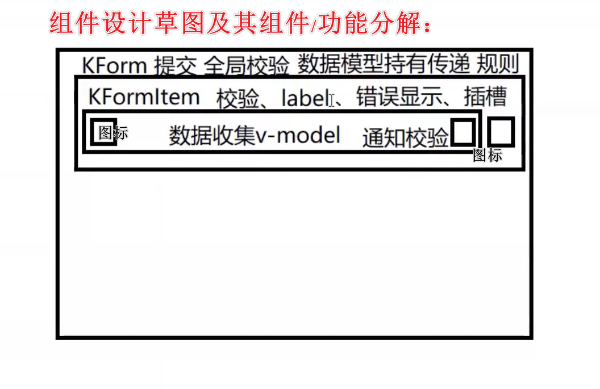

# Vue2 知识点

## 数据传递

1. provide、inject

语法：
```javascript
provide: Object | () => Object
inject: Array<string> | { [key: string]: string | Symbol | Object }
```

## 响应式原理

为了监测数组的变化，须按照下面要求进行数据修改：
1. 数据删除/修改数组长度：`this.list.splice(length)`
2. 数据修改：
   - `this.$set(this.list, indexOfItem, newValue)`
   - `this.list.splice(indexOfItem, 1, newValue)`

为了监测对象的变化，须按照下面要求进行数据修改：
1. 修改一个属性：`this.$set(this.currentForm, formItem, newValue)`
2. 修改多个属性：`this.currentForm = Object.assign({}, this.currentForm, { xxx }`

当使用修改原数组的方法时，可以检测到数组的变化（响应式）：push、pop、unshift、shift、splice、sort、reserve

## computed操作

1. computed传入参数

解释：正常的computed变量，直接传入变量名称即可（就会return 一个返回值过来），若想要传入参数，则里面需要再嵌套一个函数

```vue
computed: {
  getCurrentPerson () {
    return (personId) => {
      return this.persons[personId]
    }
  }
}

<!-- html中使用 -->
<el-form v-model="getCurrentPerson(21)"></el-form>
```

## vuex基本操作

注意：
1. vuex的数据更新必须遵守vue的响应规则

操作流程如下：
<!-- tabs:start -->

<!-- tab:store.js -->
```vue
state: {
  count: 0
},
getters: {
  getCount: (state, payload) => {
    return state.count
  }
},
// 同步请求使用mutations
mutations: {
  SET_COUNT (state, payload) => {
    state.count += payload.count
  }
},
// 异步请求使用actions
actions: {
  asyncSetCount ({ commit, state }, payload) => {
    commit('SET_COUNT', payload)
  }
}
```

<!-- tab:组件中使用 -->
```vue
// 直接访问
this.$store.state.count
this.$store.getters.getCount
this.$store.commit('xxx', payload)
this.$store.dispatch('xxx', payload)


// 导入访问
import { mapState, mapGetters, mapMutations, mapActions } from 'vuex'

computed: {
  ...mapGetters({
    // 和mapState类似
  })
  ...mapState({
    count: state => state.count,
    countAlias: 'count',
    // 使用this
    comCount (state) {
      return state.count + this.localCount
    }
  })
}

methods: {
  // mapActions和mapMutations类似
  // 此时：this.setCount等同于this.$store.commit('setCount')
  ...mapMutations([
    'setCount'
  ]),
  // 或者
  ...mapMutations({
    add: 'setCount'
  })
}

```

<!-- tabs:end -->

## 基本用法

vue获取事件对象的方式：
1. 设置`@click='getData'`：不带括号时，默认第一个参数是事件对象
2. 设置`@click='getData($event)'`：带括号时，需显式传入事件对象`$event`

v-model原理：
1. 使用组件时：
   1. `v-model="value"` <=> `value="value" @input="value = $event"`
   2. `:value.sync="value"`
2. 组件内部：
   1. `<input :value="value" @input="onInput">`
   2. `props: ['value']`
   3. 第一种方式：`onInput (e) { this.$emit('input', e.target.value)}`；第二种方式：`onInput (e) { this.$emit('update:value', e.target.value)}`


## 组件通信

组件通信的方式：
1. 🥭父传子：
   1. `props`：父子组件传值，父组件需绑定传入的props，子组件须在props变量中声明传入的props
   2. `$attrs`：当父子组件传值时，子组件未使用props声明的变量，将统一归纳到`$attrs`当中
   3. `$refs`：父子传值，父组件设置ref属性，可通过ref属性获取子组件的this(包括子组件的数据和方法)
   4. `$children[index]`：其中$children访问的是当前组件的所有子组件，可通过索引来访问特定的子组件
2. 🥝子传父（通过事件监听）：
   1. `$emit`：子组件通过$emit将值传入到父组件中，父组件通过事件进行接收
   2. 通过绑定一个函数传入到子组件中，然后执行该props触发父组件方法
   3. 通过$parent
3. 🍍兄弟传值：
   1. 使用$on和$emit和$off，结合中间件bus(详情见components/getProsp)
4. 🍊祖孙传值：
   1. provide（祖组件使用，和data类似）和inject（孙组件使用，和props类似）；此方法仅需在祖组件中使用provide，在需要该值的后代组件中使用inject即可
   2. $attrs（中间组件使用，通过属性形式，`v-bind='$attrs'`，这样中间组件的子代能够访问中间组件父组件的数据）和$listeners（中间组件使用，通过事件形式，`v-on='$listeners'`，这样中间组件的父代能够监听中间组件子组件触发的事件），是props和$emit的增强版；此方法需要层层使用该属性
5. 🍋任意组件传值：
   1. 事件总线（实现见下）
   2. vuex

注意：
1. 组件定义的标签属性，当未使用bind绑定时，代表一个常量字符串，使用bind绑定时表示一个变量

```javascript
// 🥭
// 1. props传值
// 父组件
<Child :msg='message'/>
// 子组件
props: ['msg']

// 2. $attrs
// 父组件
<Child msg='message'/>
// 子组件使用：
this.$attrs.msg

// 3. $refs
// 父组件
<Child ref='child'/>
this.$refs.child.xx = 'xxx'
this.$refs.getMethods()
// 子组件
data () {
  return {
    xx: 'hhh'
  }
},
methods: {
  getMethods () {}
}

// 🥝
// 子传父：通过$emit
// 父组件：
<Child @getChild='getChild'/>
getChild (data) {
  // ....
}
// 子组件：
this.$emit('getChild', { a: 1, b: 2 })

// 🍋
// 事件总线的实现
class Bus {
  constructor () {
    this.callbacks = {}
  }
  $on (name, fn) {
    // 一个事件可以有多个监听回调
    this.callbacks[name] = this.callbacks[name] = []
    this.callbacks[name].push(fn)
  }
  $emit (name, args) {
    if (this.callbacks[name]) {
      // 遍历监听并执行回调函数
      this.callbacks[name].forEach(cb => cb(args))
    }
  }
}

// 实践中直接使用Vue的实例代替即可
export default new Bus
```


## 插槽

1. 🍀匿名插槽
2. 🍅具名插槽
3. 🍌作用域插槽：数据在子组件中，需要使用到子组件的数据时使用该插槽


```javascript
// 1.🍀 匿名插槽
// 内部组件child
<p>
  <slot>abc</slot>
<p>
// 使用内部组件
<child>def</child>

// 2. 🍅具名插槽
// 内部组件
<p>
  <slot>abc</slot>
  <slot name="content"></slot>
</p>
// 使用内部组件
<child>
  <template v-slot:default>
    具名插槽
  </template>
  <template v-slot:content>
    内容content...
  </template>
</child>

// 🍌作用域插槽
// 内部组件
<p>
  <slot>abc</slot>
  <slot name="content" :age="age"></slot>
</p>

data () {
  return {
    age: 45
  }
}
// 使用内部组件
<child>
  <template v-slot:default>
    具名插槽
  </template>
  <template v-slot:content="{ age }">
    年龄：{ age }
  </template>
</child>
```

## 组件构建

1. 在使用组件时，若不想一个个使用props，可使用$attrs继承所有属性
   1. 防止属性在组件内部的根上也有该属性，可在组件内部使用inheriteAttrs:false（和data同级）
2. 表单组件构建时，可使用第三方校验库

## 实战

> 实现一个element 表单

**_需求分析_**：

实现功能要点：
- 数据收集：输入框、下拉选择框、单选框
- 校验：单项校验（比如blur时）、全局校验（比如submit时）
- 提交：提交事件

组件设计草图：
  

**_实现_**：

输入框KInput所需功能：
- v-model
- 通知校验

输入项KFormItem所需功能：
- 插槽
- 展示label、error
- 校验