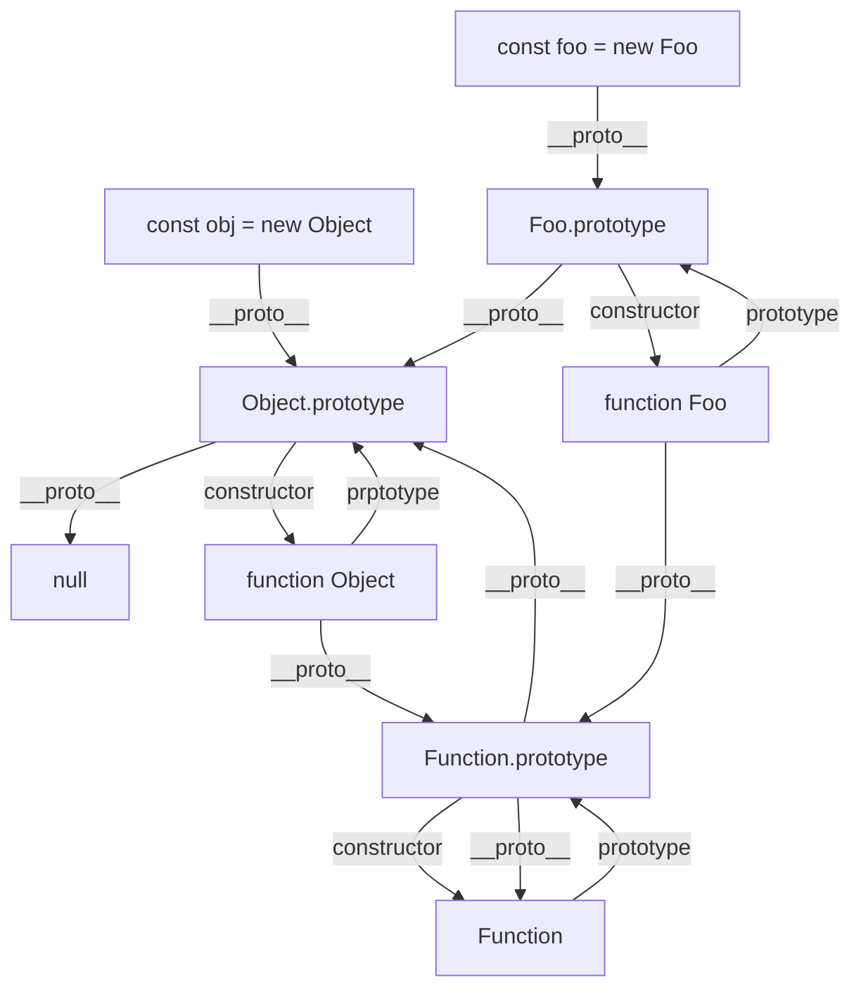

# 速记手册

> 网站集合：
> https://fe.ecool.fun/

## 1. 对象的数据属性和访问器属性

数据属性：
- writable：值是否可写
- value
- enumerable：值是否可枚举
- configurable：数据属性是否可修改

访问器属性：
- get:
- set:
- enumerable:
- configurable:

相关方法：
- `Object.defineProperty(obj, key, { // descriptor obj })`
- `Object.defineProperties(obj, { key: { // descriptor obj}, ...})`
- `Object.getOwnPropertyDescriptor(obj, key)`

## 2. toString()和valueOf()

toString:
- 将对象转成一个原始值

valueOf:


注意：
- 数字的强制转换和原始值的强制转换，会优先调用valueOf()
- Date对象优先调用toString()，若该方法返回非原始值，则会调用valueOf()
- String()、alert()优先调用对象的toString()，
- 强制类型转换的地方有：在进行`+`、`==`运算时，一方有非数字类型

## 3. 如何实现设置localStorage的有效期？

实现思路：
- 第一种：
  1. 调用setItem存值时，将item存储为一个对象格式，里面包含属性有value、expires（过期时间格式，转为统一的time时间戳格式）
  2. 取值时，将过期时间戳expires与当前的时间戳对比，过期则清空
  3. 清空逻辑有：比如定时器、用户操作时、窗口聚焦时、鼠标滚动时等
- 第二种：查看是否有开源的组件，进行调用

## 4. 浏览器的缓存策略（强缓存和协商缓存）？

> 参考：
> https://www.jianshu.com/p/2961ce10805a
> https://blog.csdn.net/Huangmiaomiao1/article/details/125862342
> https://blog.csdn.net/m0_65335111/article/details/127348516

## 5. 数组的常用方法

修改数组：
- fill(value, start, end)
- pop()
- shift()
- push(value, ...)
- unshift(value, ...)
- splice(start, count, value, ...)

返回新数组：
- `concat(value, arr, ...)`
- filter(value, index, arr)
- find
- flat(depth)：数组扁平化
- flatMap(value, index, arr)：返回若直接返回value，功能和flat(1)类似，否则遍历元素，返回每个的结果
- map(value, index, arr)
- reduce((value, index, arr) => {}, initval)
- slice(start, end)

返回迭代器对象：
- keys()
- values()
- entries()

其他：
- find/findLast
- findIndex/findLastIndex
- reverse()
- forEach
- some，一个truth即返回true
- every，所有truth即返回true
- sort(sortFn)
- includes(value, fromIndex)
- join(value)
- Array.from(arr, newArrCallback)：对类数组/可迭代对象转为数组，同时对新数组进行map回调，返回返回新的值
- Array.of(value, ...):将参数表列转为一个数组

## 6. 异步编程

包含：
- Promise
- async-await
- generator
- 回调函数，将同步变异步，类似f1(f2)的方式，可结合settimeout一起，简单但高耦合
- 事件监听
- 发布订阅模式（观察者模式）

## 7. 闭包

> 参考：
> https://www.ruanyifeng.com/blog/2009/08/learning_javascript_closures.html
> https://zh.javascript.info/closure

> 闭包使用场景：
> https://juejin.cn/post/6844903619595075592
> https://segmentfault.com/a/1190000023425946

定义：
- 闭包是能够读取其他函数内部变量的函数
- 由于只有函数内部的子函数才能够读取函数的局部变量，故闭包可以理解为定义在一个函数内部的函数
- 闭包是指一个函数可以记住其外部变量并可以访问这些变量

## 8. 引入css和执行js会阻塞html的渲染吗？

从浏览器输入url到页面渲染的过程中，html通过html解析器生产DOM树，css通过css解析器解析成css对象，然后组成CSSOM树，解析过程互不影响，是并行解析的。**但是**，渲染树需要结合DOM树和CSSOM树才能够生成，这一步会阻塞html的渲染。

具备async和defer属性的script会异步执行脚本，其中：
- async：脚本返回后，若html未解析完，浏览器会暂停解析html，先让js引擎执行代码，这时会阻塞html的渲染
- defer：脚本返回后，若html未解析完，浏览器会继续解析html，在html解析完毕后再执行js代码，不会阻塞html的渲染

## 9. 类型判断的方式

typeof：
- 能准确判断所有基础数据类型，引用类型会判断为object
- null会判断为object
- Function和函数会判断为function

instanceof：
- 能准确判断引用数据类型，不能判断基础数据类型（得不到正确的结果，因为基础类型类型Number等其实都是对象）


`Object.prototype.toString.call(value)`：
- 能够获取到所有准确的数据类型

## 10. css选择器分类

- 基础选择器：
  - 标签选择器（元素选择器，`div`）
  - id选择器（`#title`）
  - class选择器（`.title`）
  - 通配符选择器（`*`）
  - 群组选择器（逗号选择器，`div, p, span`）
- 关系选择器：
  - 后代选择器（空格选择器，`.parent .child`）
  - 子代选择器（大于号选择器，`div>.first`）
  - 相邻选择器（加号选择器，`.first+.second`）
  - 兄弟选择器（选择器，`div~p`）
- 属性选择器：
  - `div[class]`
  - `div[class='parent']`
  - `div[class^='par']`
  - `div[class$='par']`
  - `div[class*='par']`，属性值里面包含该字符串即可
  - `div[class~='par']`，属性值必须完全匹配
  - `div[class|='par']`，匹配以par或par-开头的
- 伪类选择器：用于选择元素
  - :first-child, :nth-child(n)
  - :first-of-type(表示第一个子元素)，:nth-of-type(n)
  - :not()
  - :link, :visited, :hover, :active
- 伪元素选择器
  - :before, :after
  - ::first-letter, ::first-line(分别表示第一个字母和第一行)

## 11. 深拷贝和浅拷贝

## 12. 原型链图

原型：
- 原型（prototype）是函数function对象的一个属性，它定义了构造函数制造出来的对象（new运算符调用的函数）的公共祖先
- 通过构造函数产生的对象可以继承到该原型的属性和对象，原型也是对象。
- 隐式原型(__proto__-->每个实例上都有的属性)和显式原型（prototype-->构造函数的属性）
- 对象的原型（对象原型的最顶端是null）

原型链：
- 在原型上再加一个原型，再加一个原型..把原型连成链，访问顺序也是按照这个链的顺序跟作用域链一样，叫做原型链



## 13. css属性继承

所有元素都可继承的：
- visibility
- cursor

子元素可继承的：
- letter-spacing、word-spacing、white-spacing
- line-height
- font、color
- text-(decoration、transform、indent、align)、direction

列表元素可继承的：
- list-style

表格元素可继承的：
- border-collapse

不可继承的属性，若想和父元素保持一致，可将该属性设置为inherit

## 15. vue组件通信方式

vue2：
- 父子通信：
  - props、emits
  - slot
  - `v-bind:val.sync`(父)和`emit('update:val', data)`(子)
  - `v-model:obj='xxx'`(父)和`emit(updateValue, data)`，且子组件传入props obj，同时作用于input(子)
  - `v-model="xxx"`(父)和`emit(input, data)`，且子组件传入props value，同时作用于input(子)
- 祖孙通信：
  - $attrs(传过来的非props的v-bind属性)、$listeners(接收所有绑定的事件)，可使用`v-bind="$attrs"`和`v-on="$listeners"`全部传递
  - $refs、$children、$parent、$root
  - provide`(void => {}`、inject(`arr`)
- 跨组件通信：
  - 全局事件总线
  - mixin(mixin配置的内容都会混入到当前组件中)
  - vuex
  - [pubsubjs](https://www.npmjs.com/package/pubsub-js)(JavaScript的发布订阅库)

vue3:
- props、emits
- v-model
- refs
- provide、inject
- eventBus（通过第三方库：mitt、tiny-emitter）
- vuex
- pinia
<!-- tabs:start -->

<!-- tab:全局事件总线 -->
```vue
new Vue({
  beforeCreate() {
    Vue.prototype.$bus = this
  }
})
// 1. 接收数据
this.$bus.$on('receiveParams', data)

// 2. 发送数据
this.$bus.$emit('receiveParams', data)
```
<!-- tabs:end -->

## 16. 重绘repaint和重排reflow(回流)

重绘：结构未变化，只是改变了某个元素的外观风格，而不影响周围或内部的布局时，会发生重绘，情况有：
- 改变背景属性
- 改变字体颜色
- visibility属性变化
- box-shadow变更

重排：结构、尺寸、排版发生了变化，或者说页面上元素的占位面积、定位方式、边距等发生了变化，会引起重排，情况有：
- 网页初始化时
- 增删dom节点时
- 移动dom节点、给dom节点添加动画
- 窗口大小发生变化时、页面滚动时
- 元素内容发生变化时、元素尺寸发生变化时、元素字体大小种类变化时
- 查询调用某些属性时（offsetxxx、scrollXXX、clientXXX、设置style属性、调用getComputedStyle）

注意：
- **重排一定会引发重绘**，因为得重新定义结构布局，然后渲染css样式

优化技巧：
- 不适应table布局，table布局的一个改动会造成整个table重新布局
- 读、写操作不放在同一个语句
- 不一条条修改dom样式（不如修改css class）
- 复杂动画的元素使用绝对定位，脱离文档流，不影响其他节点
- 使用虚拟dom
- 避免使用css表达式

## 17. 宏任务、微任务、同步任务

事件循环的本质
- 作为单线程js对异步事件的处理机制
- 仅有一个主线程js的处理逻辑，保证主线程有序、高效、非阻塞的处理

事件循环处理逻辑：
- 同步任务、异步任务（又分为微任务、宏任务，且宏任务优先级高）分别进入不同的执行场所
- 同步任务直接在主线程执行，异步任务则在事件队列event queue中等待
- 当全部同步任务执行完毕后，再去event queue中执行异步回调的函数，异步回调的函数进入到主线程执行
- 异步任务内部的内容，又依次进行上述步骤，这样的机制，叫做事件循环

执行顺序：
- 代码执行顺序：同步任务 -> 微任务 -> 宏任务
- 微任务执行顺序：process.nextTick -> Promise
- 宏任务执行顺序：setImmediate -> setTimeout -> setInterval -> I/O操作 -> ajax

微任务：
- Promise里面的(then、catch、finally)
- async/await
- process.nextTick
- Object.observe(实时监测js对象的变化)
- MutationObserver(监听DOM树的变化)

宏任务：
- 整体代码script
- setTimeout、setInterval、setImmediate
- I/O操作（输入输出，比如文件读取、网络请求）
- ui render（dom渲染）
- ajax

注意：
- vue.nextTick用于在下次dom更新（宏任务）循环结束后执行的延迟回调，在修改数据之后立即使用 nextTick 来获取更新后的 DOM。 nextTick主要使用了宏任务和微任务。 根据执行环境分别尝试采用Promise（微）、MutationObserver（微）、setImmediate（宏），如果以上都不行则采用setTimeout定义了一个异步方法，多次调用nextTick会将方法存入队列中，通过这个异步方法清空当前队列

## 18. css样式隔离

样式隔离方案：
- scoped：例如vue中的`<style scoped>`
- BEM：防止命名冲突，其中B(block)、E(element)、M(modifier)，例如`class="block-subblock__element--modifier"`
  - 解决方式是通过namespace，可使用tailwind css、isolation（css isolation、angular component styles）
- css-loader：css模块话，将css类名加上哈希值
- css in js：使用js编写css，让css拥有独立的作用域，阻止代码泄露到外部，防止样式冲突
- 预处理器
- shadow DOM（比如微前端）

## 19. 事件委托、事件冒泡、事件捕获

事件委托（事件代理）：
- 即事件（比如点击事件、鼠标移动事件等）本来是加在子元素上，却加在父祖元素上来监听，利用了事件冒泡的原理，因为事件最终都会加在父级上触发执行效果
- 事件委托的好处是减少事件注册，节省内存占用，新增节点时，后续节点自动拥有之前绑定的事件
- 事件委托的缺陷是逻辑变多时，可能会出现事件误判

事件冒泡：
- 事件会从目标节点流向文档根节点，途中会经过目标节点的各个父级节点，

事件捕获：
- 事件从文档根节点流向目标节点，途中会经过目标节点的各个父级节点

注意：
- 事件的处理过程：先捕获，后冒泡
- 事件处理过程中，若某个节点定义了多个同类型事件，某个事件使用了`event.stopImmediatePropagation()`，其他同类型事件不会执行
- 阻止事件的默认操作（比如点击a标签会跳转，点击提交按钮会将数据提交到服务器等）可以用`event.preventDefault();`来阻止
- 阻止事件冒泡和事件捕获：`e.stopPropagation()`
- `addEventListener(event,fn,useCapture)`：第三个参数表示是否触发事件捕获过程
- addEventListener和on的区别：on事件会被后面的on事件覆盖，前者不会

## 20. 遇到的难解决的问题

难解决的问题分为两种：
1. 业务问题，需求不清。这时需要拉上懂业务的同事理清需求，必要的时候需要调整设计。同时自主学习，增强对业务的了解。
2. 技术问题，可能是由于之前技术栈限制导致需求难以实现，或者说现有技术导致实现需求会有性能、可维护性问题，或者是自身储备或者周边资源不足(比如说没有现成的组件库)导致工期比预想长。可以通过最小限度实现需求、请教公司或同项目组的同事寻找合适的工具、交叉集成其他框架等方式解决，但最重要的是及早沟通。

注意：
- 遵循star法则回答