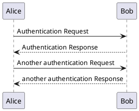
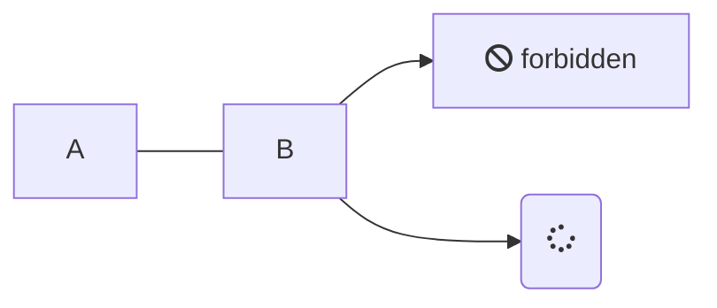

# usage-docsify-plugin

## 绘制uml



## 绘制流程图



## 展示pdf

```markdown
# ```pdf
# https://simply-none.github.io/latest-blogs/_media/1.pdf
# ```
```

## 展示提示样式

> [!NOTE]
> An alert of type 'note' using global style 'callout'.

> [!TIP]
> An alert of type 'tip' using global style 'callout'.

> [!WARNING]
> An alert of type 'warning' using global style 'callout'.

> [!ATTENTION]
> An alert of type 'attention' using global style 'callout'.

> [!NOTE|style:flat]
> An alert of type 'note' using alert specific style 'flat' which overrides global style 'callout'.

> [!TIP|style:flat|label:My own heading|iconVisibility:hidden]
> An alert of type 'tip' using alert specific style 'flat' which overrides global style 'callout'.
> In addition, this alert uses an own heading and hides specific icon.

> [!COMMENT]
> An alert of type 'comment' using style 'callout' with default settings.

## 使用icon

> icon地址：https://fontawesome.com/icons

<i class="fa-regular fa-bell-slash"></i>
<i class="fas fa-home fa-fw"></i>

## 页脚增强

Text
Text

1. More Text
2. More Text